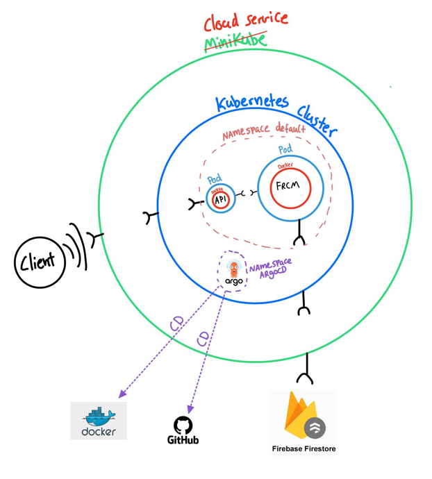
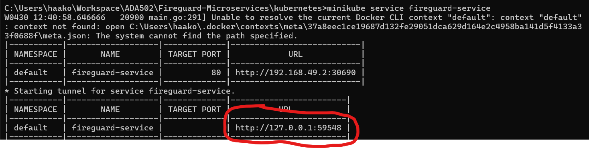

# Fireguard-Microservices

[](http://34.77.27.251:9001/dashboard?id=firerisk)

## How to setup Firestore - database example guide!
📚 [Check out this Wiki!](https://github.com/FireGuardProject/Fireguard-Microservices/wiki/FIRESTORE-GUIDE)

## Setting Up the FireGuard Application in a Local Kubernetes Environment
This guide walks you through the process of setting up the FireGuard application on your local machine using Minikube and Kubernetes. Follow the steps below to deploy the application and access it through a local service.

### Prerequisites for Running This Repository:
Before you start, ensure you have the following prerequisites installed on your machine:
 * Docker Deskop - For managing docker images and containers. Install [here](https://www.docker.com/products/docker-desktop/)
 * Minikube - For creating a local Kubernetes cluster. Install [here](https://minikube.sigs.k8s.io/docs/start/)
 * Kubectl - For interacting with the Kubernetes cluster. Install [here](https://kubernetes.io/docs/tasks/tools/)
 * Postman - For interacting with the API endpoints. Install [here](https://www.postman.com/downloads/)


### System overview




### Getting Started
First you need to clone the github repo to you own machine! Go into your working directory in the terminal and paste:
```sh
git clone https://github.com/FireGuardProject/Fireguard-Microservices.git
cd Fireguard-Microservices
```
This repo uses microservices as submodules, so you need to fetch these submodules:
```sh
git submodule init
git submodule update
```
Then you can navigate to the directory containing the Kubernetes configuration files for the FireGuard application:
```sh
cd kubernetes
```
### Starting Docker
Before starting the process with running minikube, you need to make sure that docker is running. Simply start the Docker Desktop application you downloaded earlier, and make sure that the Docker Engine is running.

### Starting Minikube
Start your Minikube environment with the following command:

```sh
minikube start
```
This command initializes a local Kubernetes cluster using Docker as the driver. It prepares Kubernetes along with necessary addons like the storage-provisioner and the default-storageclass for persistent storage needs.

### Verifying Minikube and Setting Contexts
Once Minikube has started, verify that your kubectl is configured to use the "minikube" cluster and the "default" namespace by default:
```sh
kubectl config get-contexts
```

### Deploying the FireGuard Application
Deploy the FireGuard application by applying the Kubernetes manifests in the following order:

#### 1. Apply the secrets configuration:
```sh
kubectl apply -f metclient-secret.yaml
```
#### 2. Apply the port configuration:
```sh
kubectl apply -f port-service.yaml
```
#### 3. Apply the logic configuration:
```sh
kubectl apply -f logic-service.yaml
```
#### 4. Deploy the frcm microservice:
```sh
kubectl apply -f frcm-deployment.yaml
```
#### 5. Deploy the api microservice:
```sh
kubectl apply -f api-deployment.yaml
```

NB! The previous step will most likely take some time, due to downloading the Docker-image. Wait until the download is completed before moving on to the next step. 

### Verifying the Application Deployment
Check the status of the deployed resources (pods, services, deployments, etc.) to ensure everything is up and running:
```sh
kubectl get all
```
NB! Run the previous step until it is done, and you have confirmed that everything runs as expected, before moving onto the next step. You need to run kubectl get all each time you want an update of the running state. 

### Accessing the FireGuard Service
Finally, access the FireGuard service through Minikube by running:
```sh
minikube service fireguard-service
```
This command automatically opens the service in your default browser or displays a URL that you can use to access the application.

The url will give empty json shown under:
```json
{
    "detail": "Not Found"
}
```
That's because the url is not correct. The picture below shows where you will find your own IP and port after running the line above.  



Use this IP and port (your own, not the one of the picture) when you want to run one of the APIs. We have 5 different APIs you can try out! But first you need a bearer token!

### Authentication API
Our API uses token-based authentication. To obtain a token, you must use the /api/token endpoint. We would recommend you to use Postman for this. In Postman send a 'POST' request to the endpoint:
```sh
http://<ip>:<port>/api/token
```
But wait... you need a username and password. For now we will give you access to a test user. Simply use:
* username: test
* password: test

Just to make it easier for youself, you can simply paste the line below into Postman (but remember to change the 'ip' and 'port'!)
```sh
curl -d "username=test&password=test" -X POST http://<ip>:<port>/api/token
```
This call will provide you with a bearer token that can be used for 30 minutes! 

### API endpoints
FireGuard provides 5 distinct API endpoints for various functionalities. 

#### General Usage Instructions:
1. Replace 'ip' and 'port' with the IP address and port number provided by Minikube.
2. Include the bearer token in the header of your request. In Postman, you can do this by going to the "Authorization" tab, selecting type "Bearer Token", and pasting your token.
3. Send a request to the desired endpoint using request type GET, and modify the parameters as you please.

#### 1. Fire Risk After a Start Date
This endpoint calculates fire risk starting from a specific start date.

Parameters:
* start_date (string): The starting date for the calculation (format: YYYY-MM-DD).
* days (int): Number of days after the start date to calculate the risk.
* longitude (float): Longitude of the location.
* latitude (float): Latitude of the location.

Example Request:
```sh
http://<ip>:<port>/api/v2/fireriskAfterStartDate/?start_date=2024-03-21&days=4&longitude=5.32415&latitude=60.39299
```

#### 2. Fire Risk for Previous Days
This endpoint provides the fire risk assessment for a specified number of days prior to the current date.

Parameters:

* days (int): The number of days in the past to assess fire risk.
* longitude (float): Longitude of the location.
* latitude (float): Latitude of the location.

Example Request:
```sh
http://<ip>:<port>/api/v2/fireriskPreviousDays/?days=3&longitude=5.32415&latitude=60.39299
```
#### 3. Fire Risk for a Specific Period
This endpoint calculates fire risk for a specific date range.

Parameters:

* start_date (string): The start date of the period (format: YYYY-MM-DD).
* end_date (string): The end date of the period (format: YYYY-MM-DD).
* longitude (float): Longitude of the location.
* latitude (float): Latitude of the location.

Example Request:
```sh
http://<ip>:<port>/api/v2/fireriskSpecificPeriod/?start_date=2024-03-20&end_date=2024-03-25&longitude=5.32415&latitude=60.39299
```

#### 4. Fire Risk for Upcoming Days
This endpoint predicts the fire risk for a certain number of upcoming days.

Parameters:

* days (int): Number of upcoming days to predict fire risk for.
* longitude (float): Longitude of the location.
* latitude (float): Latitude of the location.

Example Request:
```sh
http://<ip>:<port>/api/v2/fireriskUpcomingDays/?days=5&longitude=5.32415&latitude=60.39299
```

#### 5. Fire Risk Before an End Date
This endpoint assesses the fire risk for the days leading up to a specified end date.

Parameters:

* end_date (string): The end date for the calculation (format: YYYY-MM-DD).
* days (int): Number of days before the end date to calculate the risk.
* longitude (float): Longitude of the location.
* latitude (float): Latitude of the location.

Example Request:
```sh
http://<ip>:<port>/api/v2/fireriskBeforeEndDate/?end_date=2024-03-30&days=4&longitude=5.32415&latitude=60.39299
```

### WooHoo!
Congratulations, you're the best! You have successfully deployed and accessed the FireGuard application in your local Kubernetes environment using Minikube. This setup is ideal for development and testing purposes. Remember, as you're using the Docker driver on Windows, keep the terminal open to maintain the service tunnel.

#### To stop and exit, run the following command
```sh
minikube stop
```

#### Additional CD pipeline configuration
Further, if you want to implement CD pipeline for the repo to the cluster, ArgoCD can be utilized for this task. Here are a guide for implementation. [Click here](https://argo-cd.readthedocs.io/en/stable/getting_started/).
